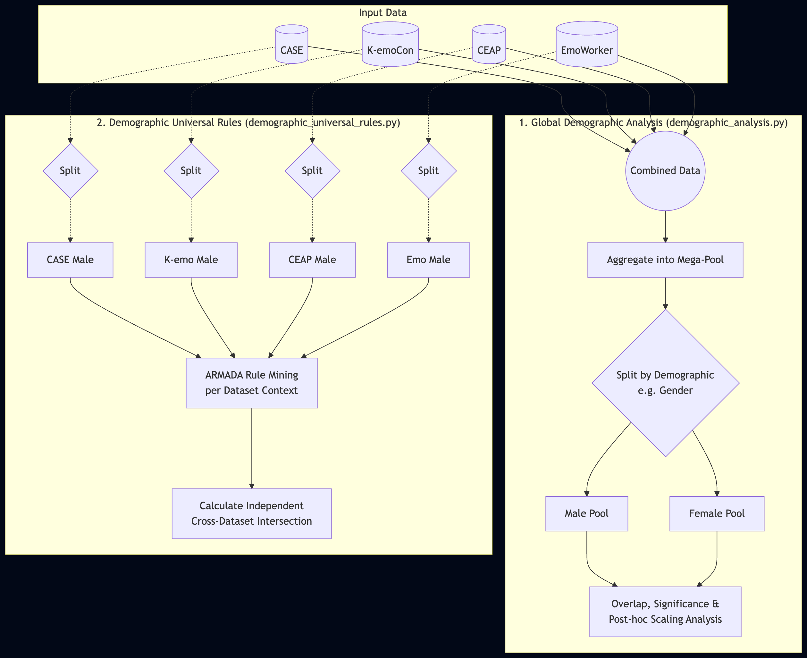

# Demographics Experiment

This module analyzes physiological ARMADA patterns by demographics:
- **Gender:** Male vs Female
- **Age:** Young (<= 25) vs Old (> 25)

The goal is to measure how demographic traits change physiological-emotional dynamics at two levels.

## 1. Global Demographic Analysis (`demographic_analysis.py`)

This analysis merges all four datasets (CASE, K-emoCon, CEAP, EmoWorker) into one Combined pool, then splits by demographics. It provides:
- Similarity metrics across groups (e.g., Jaccard index).
- Rule overlap and gender x age interaction analysis.
- Support breakdown for highly supported rules.

## 2. Demographic Universal Rules (`demographic_universal_rules.py`)

This analysis keeps datasets separate, splits each one by demographics, and finds rules that are universal across all four datasets within a subgroup. It tests whether consistent subgroup-specific physiological patterns generalize across contexts.

## Architecture Overview

### Datasets & Annotations
- **Datasets:** CASE, K-emoCon, CEAP, EmoWorker
- **Annotations:** Self-annotations (subjective participant ratings)
