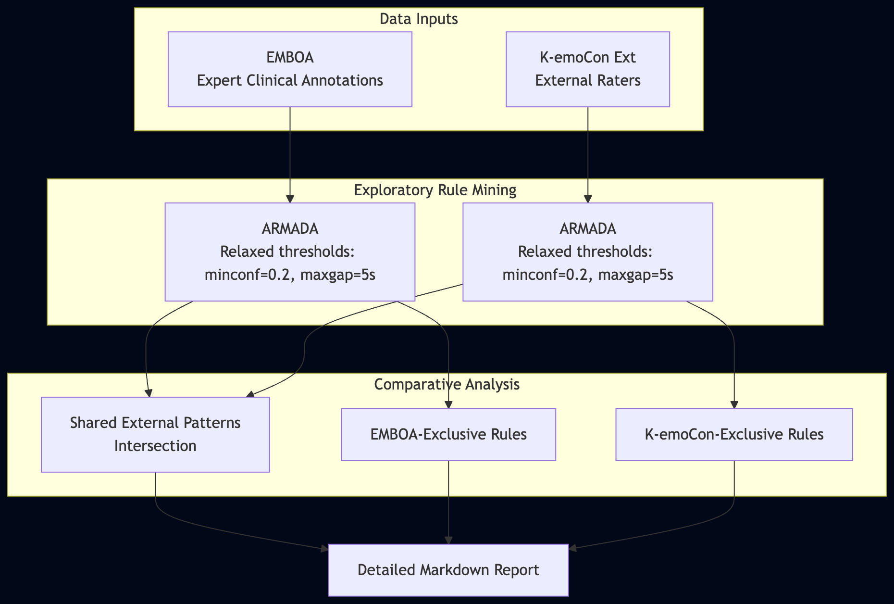

# External Annotations Experiment

This folder contains experiments utilizing external annotations (e.g., from experts or observers - like EMBOA and K-emoCon datasets) aimed at extracting physiological rules and analyzing the "external" perception of emotion-physiology connections relative to baseline groupings.

### Architecture Overview

### Datasets & Annotations
- **Datasets:** EMBOA, K-emoCon (External variant)
- **Annotations:** External-annotations exclusively (third-party observers, e.g., clinical annotations in EMBOA, external raters in K-emoCon).
