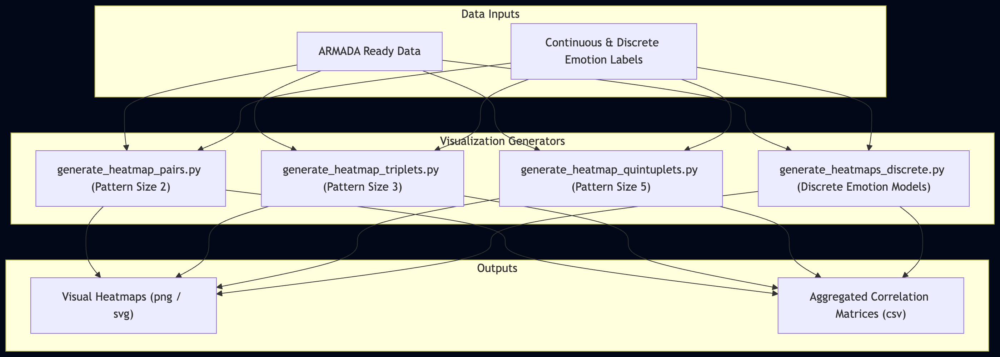

# Heatmap Analysis

A collection of visualization scripts responsible for generating heatmaps. These scripts allow for an interactive, multidimensional examination of grouped temporal rule results across varying lengths (e.g., pairs, triplets, quintuplets from ARMADA) comparing dimensional versus discrete emotion models to evaluate the strength of feature correlations in individual datasets.

### Architecture Overview

### Datasets & Annotations
- **Datasets:** CASE, K-emoCon, CEAP, EmoWorker, EMBOA, K-emoCon (External).
- **Annotations:** Both Self-annotations (participant self-report) and External-annotations (external observers' ratings) depending on the analyzed configuration.
