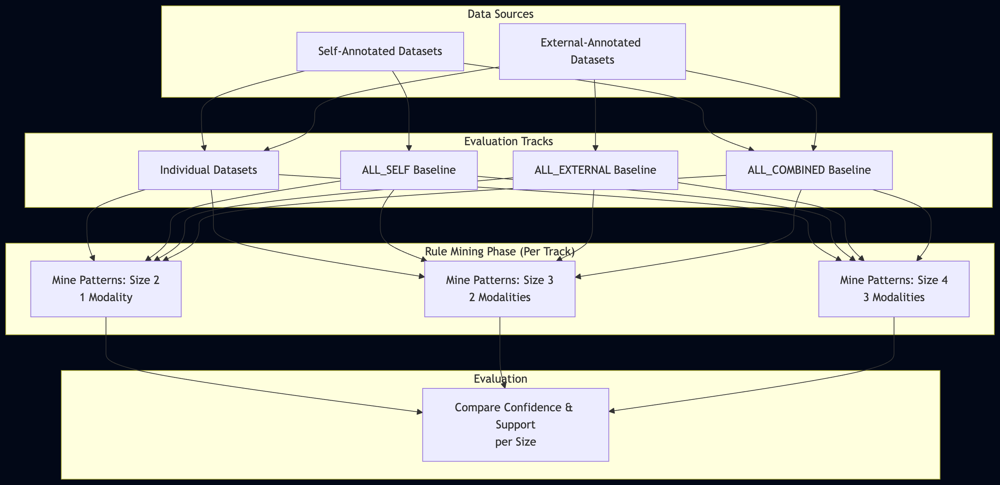

# Multimodality Advantage

An experiment analyzing the potential advantage of combining multiple physiological modalities simultaneously. The script examines and compares rules formed by short, single-signal patterns against those utilizing aggregated sequential signals of sizes 2, 3, or 4 to assess how multimodality impacts confidence scores and rule detectability.

### Architecture Overview

### Datasets & Annotations
This experiment comprehensively processes multiple types of data and annotations across predefined groups:
- **Individual Datasets:** Evaluated separately for Self Dimensional, Self Discrete, External Dimensional, and External Discrete.
- **Combined Baselines:** 
  - `ALL_SELF` (all self-annotated data merged)
  - `ALL_EXTERNAL` (all externally annotated data merged)
  - `ALL_COMBINED` (absolute mix of all datasets)

The script mines rules for each of these tracks individually.
