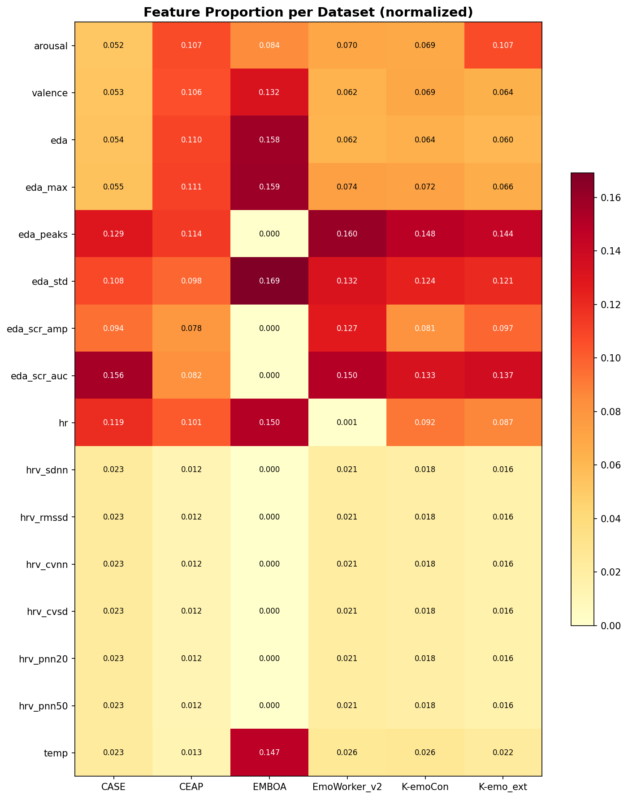
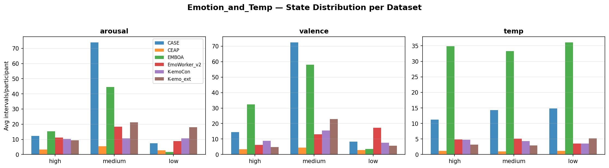
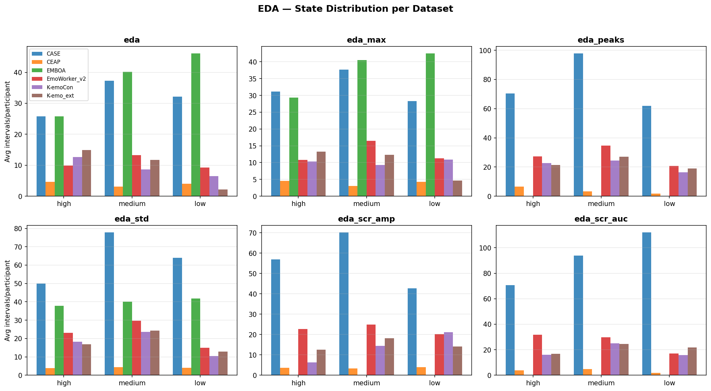
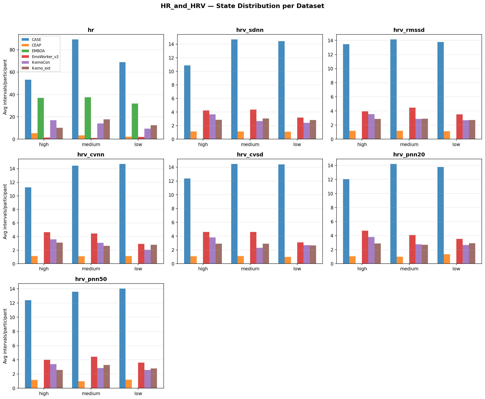
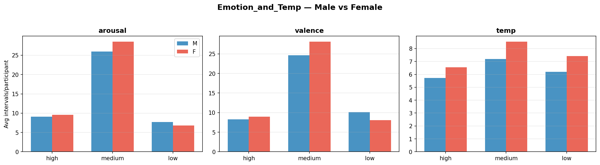
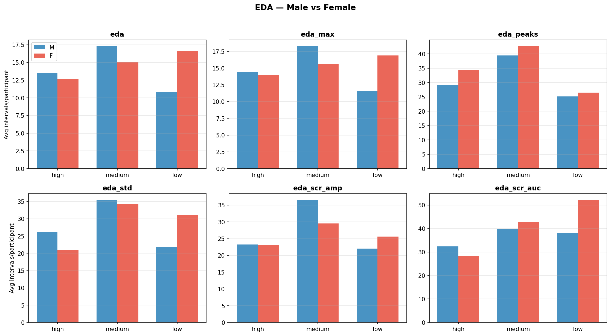
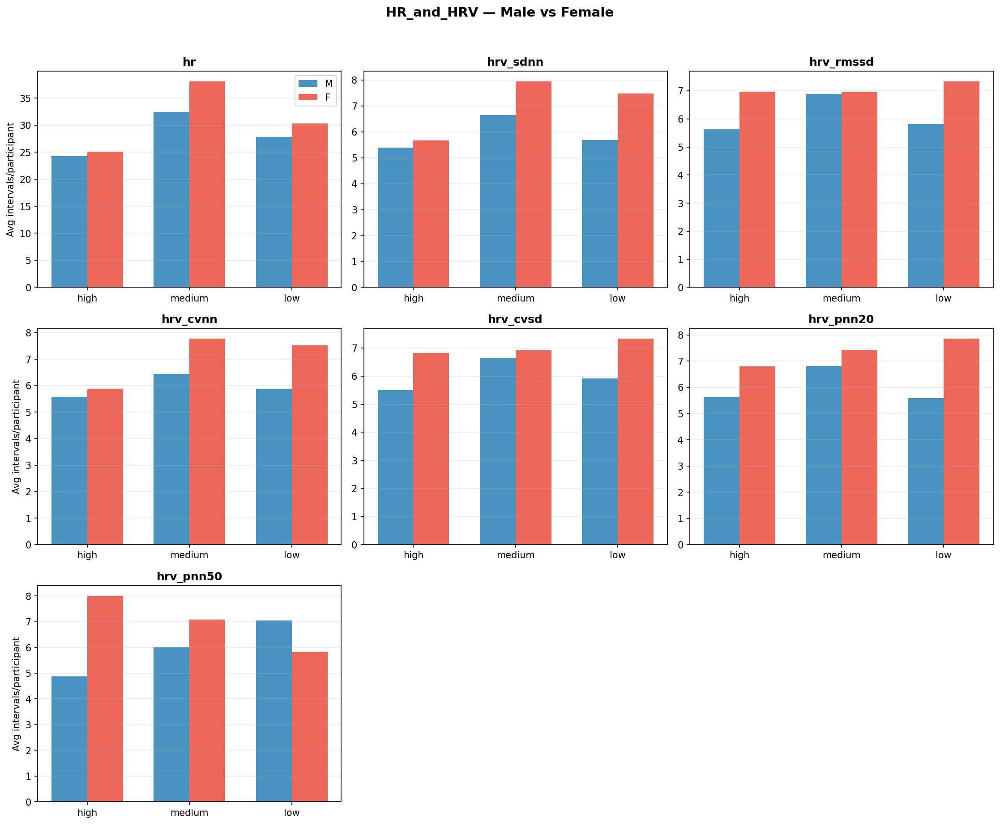
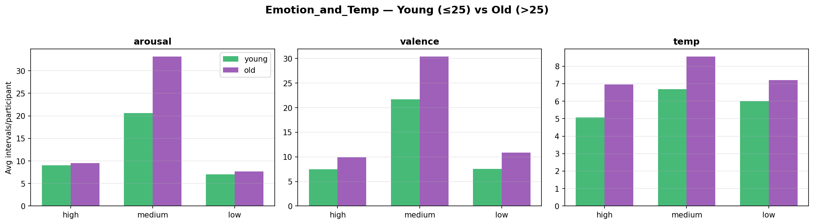
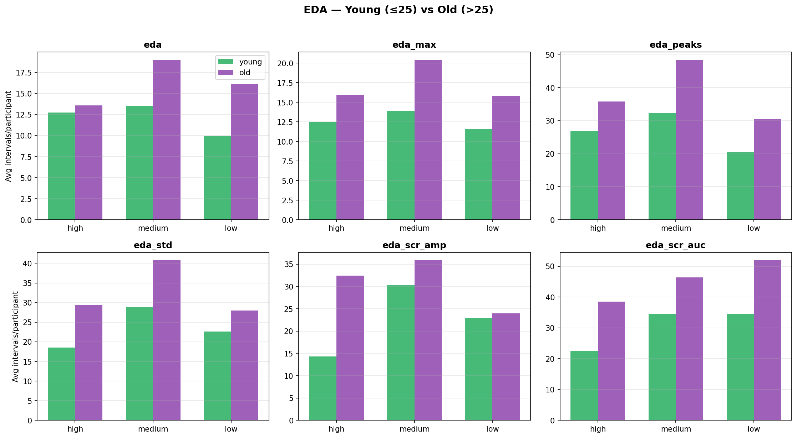
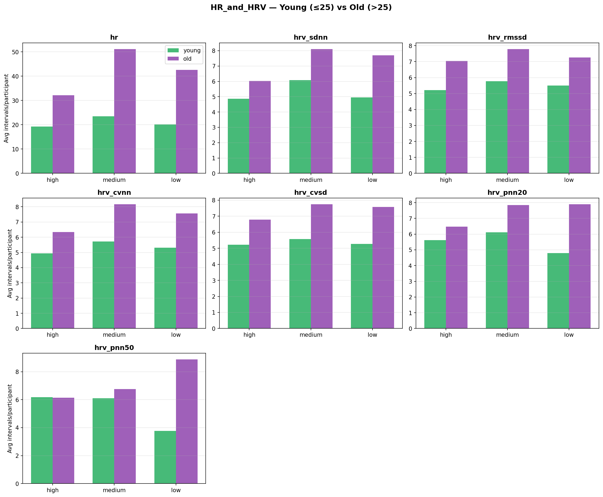

# State Distribution Analysis

Analysis of the frequency/proportion of each state label across all ARMADA datasets,
broken down by dataset, gender (M vs F), and age group (young ≤25 vs old >25).

## Dataset Summary

| Dataset      |   Participants |   Time_Series | Mean_length_s   | Min_length_s   | Max_length_s   |
|:-------------|---------------:|--------------:|:----------------|:---------------|:---------------|
| CASE         |             30 |            30 | 2485.0          | 2485.0         | 2485.0         |
| CEAP         |             32 |            32 | 84.84           | 80.0           | 85.0           |
| EMBOA        |             16 |            27 | 524.44          | 80.0           | 950.0          |
| EmoWorker_v2 |             31 |            31 | 1233.14         | 1041.88        | 1776.37        |
| K-emoCon     |             28 |            28 | 667.32          | 610.0          | 930.0          |
| K-emo_ext    |             28 |            28 | 672.32          | 635.0          | 885.0          |
| TOTAL        |            165 |           176 | -               | -              | -              |

## Feature x Dataset Heatmap

## Per-Dataset Comparison

### Emotion and Temp

### EDA

### HR and HRV

## Gender Comparison (M vs F)

### Emotion and Temp

### EDA

### HR and HRV

## Age Group Comparison (Young vs Old)

### Emotion and Temp

### EDA

### HR and HRV

